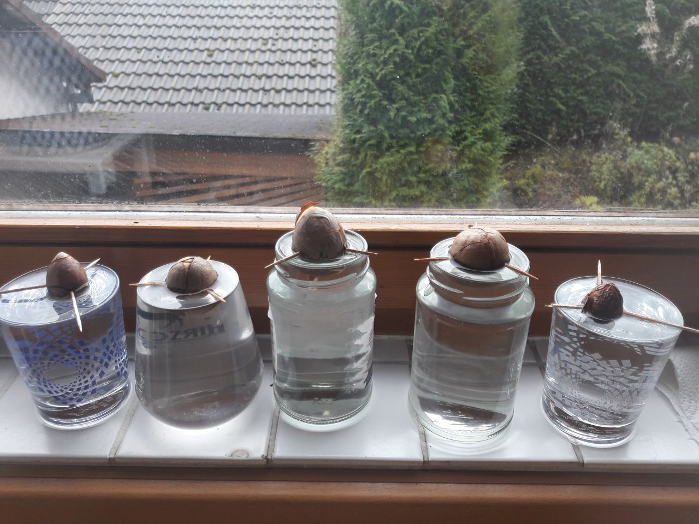
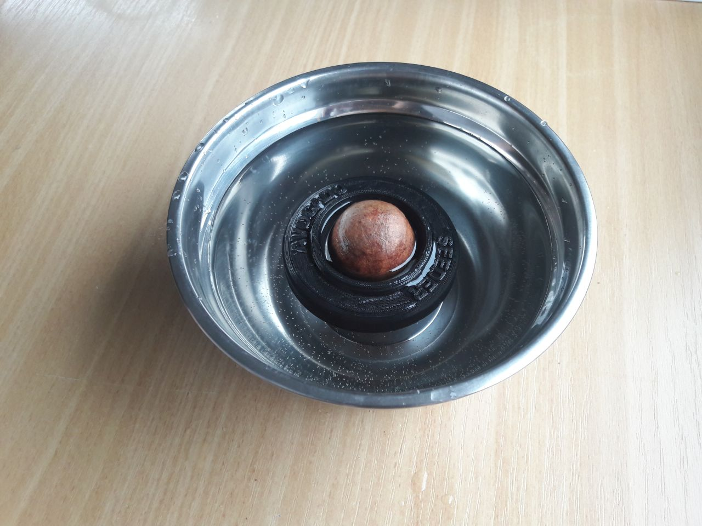
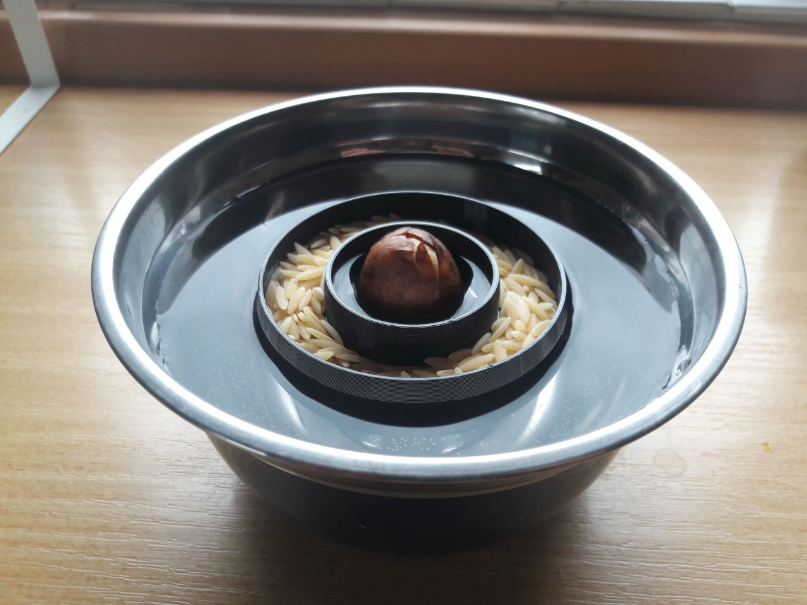

# Avocado Pit Germination Project

Hot to grow an Avocado plant from a seed.

## Preparations
Growing an Avocado plant from a seed is an easy thing to do. After you are done eating the Avocado you take the pit and clean it. Wash off any fruit to prevent molding. Let it dry for a day or two. 

## Considerations
Now there are plenty ways to continue but I figured out that the usual most popular way is a little cumbersome. It involves the _toothpick technique_ which is a solid but "costly" method. Here is my setup of this technique:

One obvious disadvantage of this methood is the water level which needs to be maintained manually and which is not desirable. Hence, I needed to find another solution which would ease the procedure.

Luckily I own a 3D printer and luckily others are facing the same problems ;)

## Challenges
The challenge for a 3D printed floating seeder is that there needs to be a way to adjust the water level of the pit depending on its size. This is required since the pit needs to be covered by water for 50%. 

Also the seeder needs to float properly and not just tip over if the seed is not a perfectly shaped monolith.

Also, the design should be easy and fast to print and not involve any major adjustments.

Lastly, the design should be as small as possible since I don't want to waste any space.

## 3D Prints
After some research I've found two solutions which seemed to a good starting point:

#### [Adjustable floating seeder](https://www.myminifactory.com/object/3d-print-adjustable-avocado-seeder-25210)

This one lets you adjust the pit carriere with a tread. Works for me since it can be adjusted to every pit size.

One disadvantage is the effort for this seeder to be printed. So I kept looking for something simpler.

#### [Floating pit holder](https://www.thingiverse.com/thing:42486)

This one lets you adjust the water level by applying some weight on top of it.

## Customization
The final step after evaluating the existing solution is to design a floating seeder based on the available solutions...

to be continued...